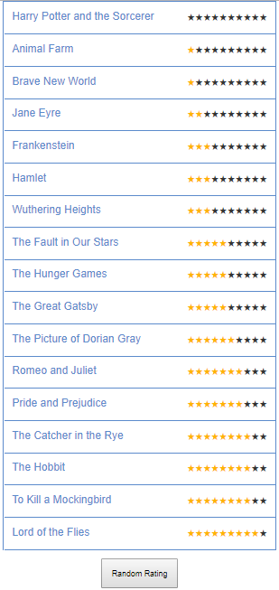

# Top Books List

### Description

It displays the list of top Book names as data provided in the JSON file with rating system.

- List of books are sorted in ascending order based on the Book rating.
- User can rate each book by clicking on rating stars for the corresponding Book.
- When user rate the book, then It will be sorted in the list according to Book rating.
- Click of the button "Random Rating" code will start rating random Book at random time with random rating. And    on same button press again it will stop random rating.


###### Sample screen:



### Get it running

- Install the dependences -  ``` npm install ```
- Run the application - ``` npm start ```
- Start the express server - ``` npm run start:server ```
- Run the tests - ``` npm test ```

